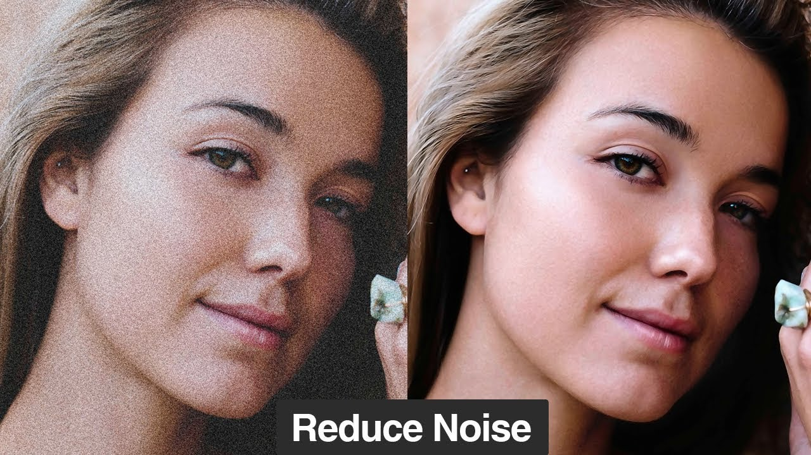
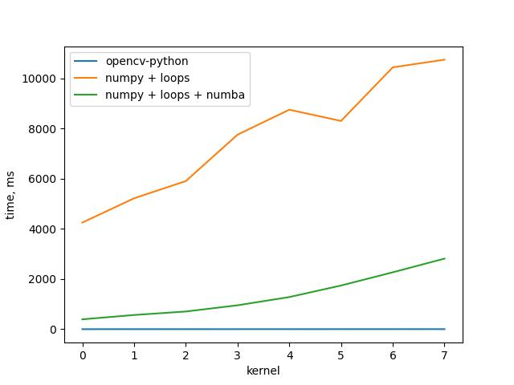

# Теоретическая база

Усредняющий фильтр Гаусса — способ размытия изображения с помощью функции Гаусса.

Этот эффект широко используется в графических редакторах для уменьшения шума изображения и снижения детализации. Визуальный эффект этого способа размытия напоминает эффект просмотра изображения через полупрозрачный экран [1].

# Описание разработанной системы

Для выполнения задания на языке Python была разработана система, реализующая фильтр Гаусса тремя способами:
- с использованием библиотеки opencv-python
- с использованием циклов языка и библиотеки numpy
- с использованием циклов языка, библиотек numpy и numba

Фильтр Гаусса использует две математические функции (одна для оси X и одна для оси Y) для создания третьей функции. Третья функция создает нормальное распределение значений пикселей, сглаживая некоторые вариации. Степень сглаживания зависит от выбранного размера радиуса размытия. Каждый пиксель будет принимать новое средневзвешенное значение относительно соседних пикселей (в первую очередь ближайших, затем — отдаленных). Результатом всех этих математических операций является размытый снимок [2].  

# Результаты работы и тестирования системы

## Оригинальное изображение

## Изображение с применением фильтра Гаусса

## Тестирование произовадительности

# Выводы по работе

В результате работы был реализован фильтр Гаусса тремя различными способами; было проведено тестирование производительности трех релизаций фильра Гаусса при увеличении размера ядра.

# Использованные источники
[1] https://ru.wikipedia.org/wiki/Размытие_по_Гауссу  
[2] https://www.adobe.com/ru/creativecloud/photography/discover/gaussian-blur.html
